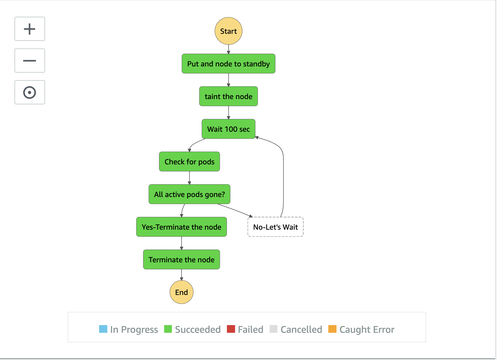

# terraform-aws-recycle-eks

This module creates a terraform module to recycle EKS worker nodes. The high level functionalities are explained below,
 - Creates a step-function that will consist of 4 lambdas. This step function will handle the transfer of inputs across the lambda functions.
 - The first lambda takes an instance id as an input, to put it in standby state. Using autoscaling api to automatically add a new instance to the group while putting the old instance to standby state. The old instance will get into "Standby" state only when the new instance is in fully "Inservice" state
 - Taint this "Standby" node in EKS using K8S API in Lambda to prevent new pods from getting scheduled into this node
 - Periodically use K8S API check for status of “stateful” pods on that node based on the label selector provided. Another Lambda will do that
 - Once all stateful pods have completed on the node, i.e number of running pod reached 0, shut down that standby instance using AWS SDK via lambda. We are not terminating the node, only shutting it down, just in case. In future releases, we will be start terminating the nodes
 

## TODO:
 - Check for new node in service before proceeding to put the existing node in standby state. Right now we are putting a sleep of 300 sec.
 - Refactor the code to use as a common module for getting the access token.
 - Better logging and exception handling
 - Make use of namespace input while selecting the pods. Currently it checks for pods in all namespaces.
 - Find a terraform way to edit configmap/aws-auth, this step is still manual to make this module work.

There are two main components:

1. Lambdas
2. Step Function in AWS, to chain the Lambdas and pass on the parameters form one Lamda to another Lamda


## Usage


```
module "recycl-eks-worker-node" {
  source = "git::git@github.com:scribd/terraform-aws-recycle-eks.git"
  name                   = "string"
  tags                            = {
    Environment = "dev"
    Terraform   = "true"
  }
  vpc_subnet_ids         = ["subnet-12345678", "subnet-87654321"]
  vpc_security_group_ids = ["sg-12345678"]
  aws_region             = "us-east-2"
  namespace = "your pod namespace" # As of now it is just a place holder we check for all namespaces now

}

```
After running the module, Run `kubectl edit -n kube-system configmap/aws-auth` and add the following:
```
mapRoles: | 
# ...
    - rolearn: <IAM role for the lamda execution>
      username: lambda

```
You can get IAM role for the lamda execution from the output variable of "lambda_exec_arn" in this module

## Running of step function

```
Step function takes an json input 

{
    "instance_id": "i-1234567890",
    "cluster_name": "eks-cluster-name-where-the-instance-belongs-to",
    "label_selector":"airflow_version=1.2.3,airflow-worker" #you can put a comma separated value for labels, either key=value or only key
}
This label selector will be the identifier on which the step function will wait and rest all pods will be ignored.

```
## Sample Output of a step function



## Development

Releases are cut using [semantic-release](https://github.com/semantic-release/semantic-release).

Please write commit messages following [Angular commit guidelines](https://github.com/angular/angular.js/blob/master/DEVELOPERS.md#-git-commit-guidelines)


### Release flow

Semantic-release is configured with the [default branch workflow](https://semantic-release.gitbook.io/semantic-release/usage/configuration#branches)

For this project, releases will be cut from master as features and bugs are developed.


### Maintainers
- [Kuntal](https://github.com/kuntalkumarbasu)

### Reference
- There is an excellent module on [Gracefully drain Kubernetes pods from EKS worker nodes during autoscaling scale-in events](https://github.com/aws-samples/amazon-k8s-node-drainer). We followed some of the principles in the Lambdas.
- [Orchestrating Amazon Kubernetes Service (EKS) from AWS Lambda](https://medium.com/@alejandro.millan.frias/managing-kubernetes-from-aws-lambda-7922c3546249) is another writeup that we referrenced while connecting to EKS from Lambda
